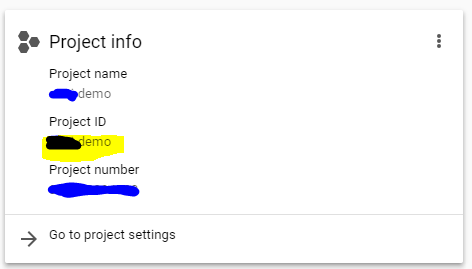
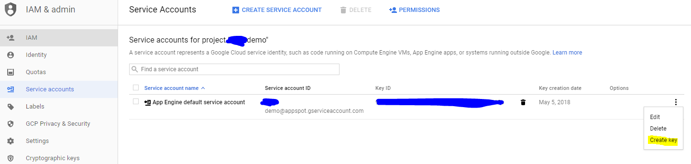
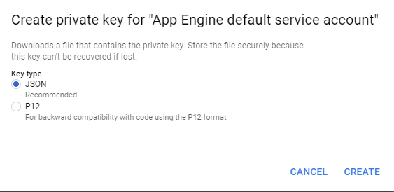
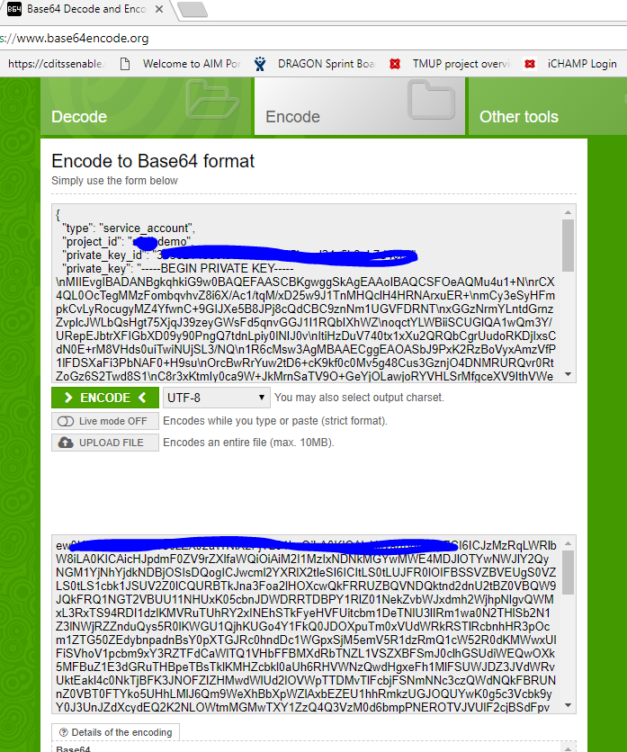

# S34J Pub Sub
A google pub sub library to be used in Spring
## Installation
Installation using gradle
```groovy
compile 'us.cuatoi.s34j:s34j-pubsub:0.3.0'
```
Installation using maven
```xml
<dependency>
    <groupId>us.cuatoi.s34j</groupId>
    <artifactId>s34j-pubsub</artifactId>
    <version>0.3.0</version>
</dependency>
```
## Quick Start
Provide projectId and base64 credential using properties
```properties
s34j.pubsub.project=pubsub-demo
s34j.pubsub.credentialBase64=ew0KICAidHlwZS...
```
Annotate your application with EnablePubSub annotation
```java
@SpringBootApplication
@EnablePubSub
public class PubSubTestApplication {
    
}
``` 
Annotate method with PubSubListener to receive message
```java
public class PubSubTestApplication {
    @PubSubListener
    public void onTestMessage(TestMessage message) { 
        logger.info("onTestMessage message={}", message);
    }
}
```
Publish a message using PubSub
```java
public class PubSubTestApplication {
    @Autowired
    private PubSub pubSub;
    
    public void sendSomeMessage() { 
        pubSub.publish(new TestMessage());
    }
}
```
## How to obtain credential to use
Copy project from dashboard page


Go to IAM & admin > Service Accounts


Create a new key with json format


Download and format key to base64


Use the key in property file
```properties
s34j.pubsub.credentialBase64=ew0KICAidHlwZS...
```
## Advanced use cases
Provide projectId and base64 credential for each topic by specifying **topic_name**.project and
 **topic_name**.credentialBase64. S34J Pub Sub will load and use credential for that topic
 
```properties
sample_topic.project=pubsub-demo
sample_topic.credentialBase64=ew0KICAidHlwZS...
```

Use addUniqueSuffix to add an unique suffix to subscription name. This is used when you want to broadcast a message
to all server.

```java
public class PubSubTestApplication {
    @PubSubListener(addUniqueSuffix = true)
    public void onTestMessage(TestMessage message) { 
    }
}
```